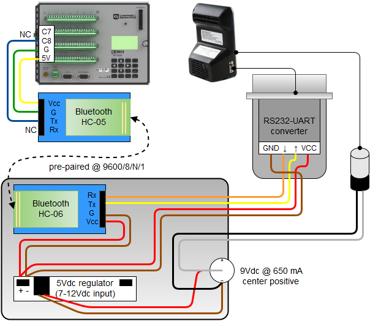
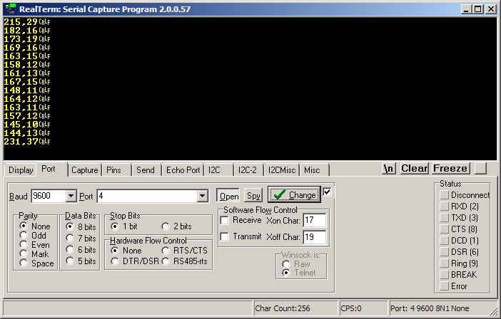

Instrument Setup Reference
==========================

> Links provided herein are for completeness only - we are not trying to
> endorse anyone.

Indoor Air
----------

### Dylos DC1100

The DC1100 requires no configuration before use: the monitor will revert to 
**CONTINUOUS MODE** at power-on, which is the correct operating mode.

#### Physical Setup

The DC1100 communicates with the indoor air data logger using Bluetooth serial
port hardware, as depicted below. Individual components are listed in the table
starting counter-clockwise from top-left.

##### Bill of Materials

| # | Description                    | Make/Model                                |
|---|--------------------------------|-------------------------------------------|
| 1 | Data logger                    | [Campbell Scientific CR3000][bom1]        |
| 2 | Bluetooth serial port (master) | HC-05, [Innogear][bom2]/equiv.            |
| 3 | Small project box              | [Hammond 1591ABSK][bom3]/equiv.           |
| 4 | Bluetooth serial port (slave)  | HC-06, [JY-MCU][bom4]/equiv.              |
| 5 | Power supply, 9Vdc in/5Vdc out | [NKC Electronics B0088OHJGI][bom5]/equiv. |
| 6 | Barrel jack, 5.5mm X 2.1mm     | generic                                   |
| 7 | 2-cond. pigtail w/ 2.1mm Ø barrel plug, 22 AWG | generic                   |
| 8 | DB9 shell cover                | generic                                   |
| 9 | RS232/TTL converter, male, 3.3/5V safe | [NulSom NS-RS232-02][bom9]/equiv. |
| - | ribbon cable, F-F jumper style | generic                                   |

  [bom1]: http://campbellsci.com/cr3000
  [bom2]: https://www.amazon.com/Innogear-Wireless-Bluetooth-Transceiver-Arduino/dp/B00JP05S6C/
  [bom3]: https://www.amazon.com/Hammond-1591ASBK-ABS-Project-Black/dp/B0002BBQNM/
  [bom4]: https://www.amazon.com/JBtek-Bluetooth-Converter-Serial-Communication/dp/B00L08GA4Q/
  [bom5]: https://www.amazon.com/Breadboard-Power-Supply-Stick-Voltage/dp/B0088OHJGI/
  [bom9]: http://www.amazon.com/Female-Male-Combo-Converter-Connector/dp/B00V3LNX1S/

The two Bluetooth serial port modules should be paired before assembly. 
Configure the slave module first, since its hardware address is required for
the master module setup.

> The receiving Bluetooth module (HC-05) is deliberately setup in half-duplex
> because it uses 3.3V logic and the CR3000 TTL serial ports are 5V. Since
> we're not sending data to the DC1100, we don't care.

##### Slave module (HC-06)

The relevant firmware, *linvor1.2*, requires commands be null-terminated (no
line terminator) and is case-sensitive. 

Connect to the module with a 3.3V-safe serial port adapter (such as 
[this one](http://shop.adafruit.com/954)). Terminal settings are 9600/8/N/1. 
Once programmed, use a Bluetooth-enabled smart phone or PC to determine the 
hardware address of the module and record it for pairing the master module.

|   | Description            | Command (no EOL)         | Response    |
|---|------------------------|--------------------------|-------------|
| 1 | Check firmware version | `AT+VERSION`             | `linvor1.2` |
| 2 | Set bluetooth name[^1] | `AT+NAMEDylos DC1100 Tx` | `OKsetname` |
| 3 | Set baud rate to 9600  | `AT+BAUD4`               | `9600`      |
| 4 | Set new password       | `AT+PINxxxx`             | `OKsetpin`  |

  [^1]: Limited to 15 characters, alphanumeric and symbols OK

##### Master module (HC-05)

The relevant firmware, *2.0-20100601*, requires commands terminate in `\r\n` 
(&lt;CR&gt;&lt;LF&gt;) and is not case-sensitive.

Connect to the module with a 3.3V-safe serial port adapter. The **KEY** pin must
be high to enable AT commands; terminal settings are 38400/8/N/1 if set high (5V)
before providing power, or current module UART settings if raised while already 
powered on (try 9600/8/N/1).

|   | Description                 | Command (\r\n)              | Response                |
|---|-----------------------------|-----------------------------|-------------------------|
| 1 | Check firmware version      | `AT+VERSION?`               | `+VERSION:2.0-20100601` |
| 2 | Update bluetooth name[^2]   | `AT+NAME="Dylos DC1100 Rx"` | `+NAME:Dylos DC1100 Rx` |
| 3 | Place into master mode      | `AT+ROLE=1`                 | *none*                  |
| 4 | Match passcode to slave     | `AT+PSWD=xxxx`              | *none*                  |
| 5 | Match baud rate to slave    | `AT+UART=9600,0,0`          | *none*                  |
| 6 | Bind to slave device        | `AT+BIND=xxxx,xx,xxxxxx`    | *none*                  |
| 7 | Enable automatic connection | `AT+CMODE=0`                | *none*                  |

  [^2]: Supports alphanumeric, space, dash; up to at least 29 characters

#### Maintenance

Clean out dust with short bursts of compressed electronics duster:

* before deployment
* weekly while in use, or more frequently if visibly dusty
* after deployment

#### Example Data

The Dylos DC1100 data stream is depicted in this screenshot:

